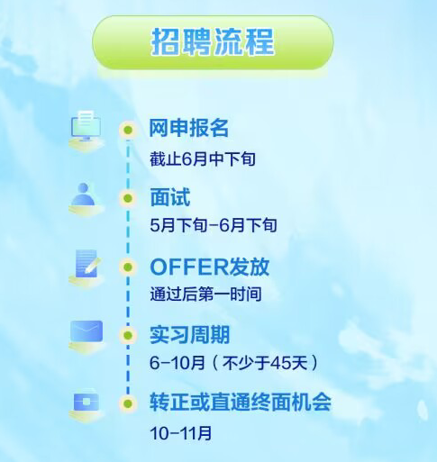
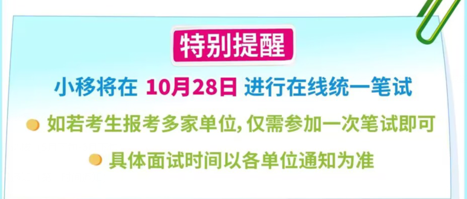
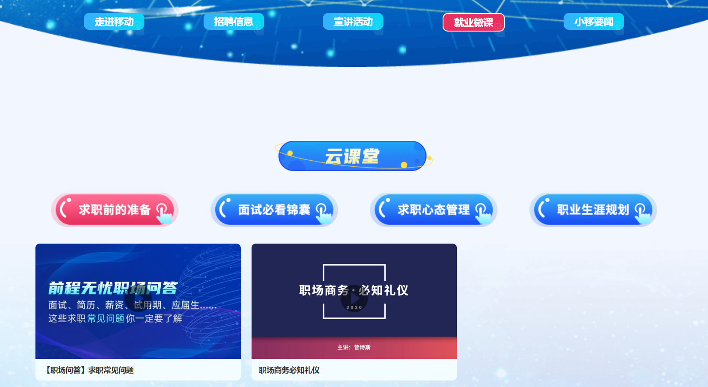
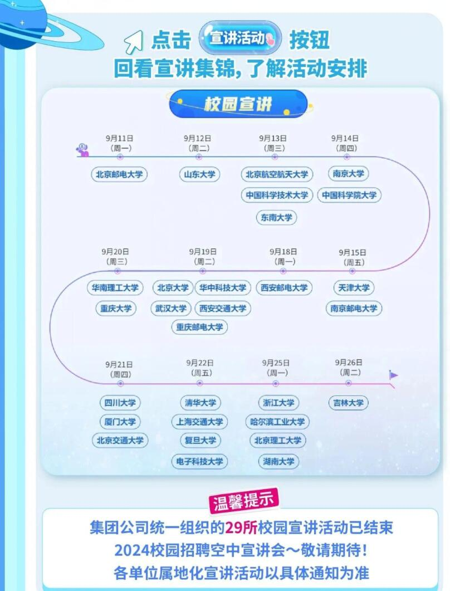

# 中国移动复习指南

## 1.途径

知乎、知乎收藏、职题库、运营商校招通、中公教育、微信中国移动公众号

招聘网站：https://2024.yingjiesheng.com/zgyd/#/zpxx?qq-pf-to=pcqq.c2c

招聘网站：https://job.10086.cn/

## 2.实习时间（重点关注一下）5月份就要开始看了

## 3.考试时间（还需要进一步确认）

#### 3.1 一个说10月28日（可能是第二批）

#### 3.2 一个说9月25日（可能是第一批）

#### 3.3 官网

## 4. 考试内容

#### 4.1 笔试

考试时间：120分钟，100道选择题，1题1分

特别注意：企业文化和行业知识**（知乎收藏有记载）**

注意：报考多个单位，只需要一次笔试

#### 4.2 面试

直接看面经即可，以及知乎收藏

## 5. 笔经和面经

#### 5.1 笔经

#### 5.2 面经

**招聘网站的就业微课：**

## 6. 宣讲活动

去招聘网站的校园宣讲：时刻关注**（有厦大，没福大）**

